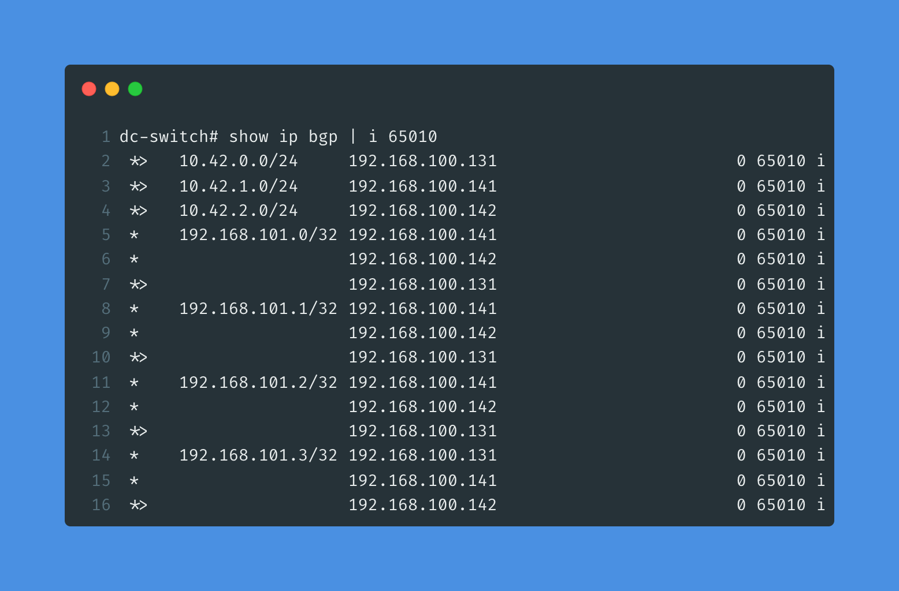

## Cilium - It's still just BGP...

Continuing on my Cilium journey, here is what the Cilium BGP config for my lab looks like at the moment.

Like (basically?) everything else in kubernetes, the BGP config is also specified in YAML. In my lab all of my BGP config exists in a single YAML file that contains multiple YAML documents, with each YAML document being separated by 3 dashes ```---```.


The first YAML document is of the kind ```CiliumBGPClusterConfig```, and it should be mostly self-explanatory as long as you've worked with BGP on a 'traditional' network device 🙂 I have a single BGP instance, called ```instance-65010```, using the ASN 65010 with a single BGP peer with the name ```dc-switch``` with IP ```192.168.100.1``` in ASN 64999. The BGP peer config has a named reference to ```peer-config-generic```, which references the next YAML document - Notice the name on line 15 🙂 

This next YAML document is of the kind ```CiliumBGPPeerConfig``` and specifies our peer config, including the address-family (AFI) and subsequent AFI (SAFI) which in this case is unicast - In 'Cisco BGP' the SAFI could also be VPNv4, etc.. Lastly it has an ```advertisement``` block that will match ressources with the label-combination ```advertise: "ns-default-advertisement"```.

The last two YAML documents starting on line 28 and 38 are both of the kind ```CiliumBGPAdvertisement```. If we look under their respective ```spec``` block, we can see they have a unique name (```ns-default-podcidr``` and ```ns-default-service```) and a ```labels``` block, where we can see we have added the label-combination ```advertise: ns-default-advertisement``` that we also specified in the ```CiliumBGPPeerConfig``` YAML document.

The first ```CiliumBGPAdvertisement``` will make Cilium advertise the ```PodCIDR``` assigned to each of our k8s nodes (more on this another time), based on the ```advertisementType: "PodCIDR"```.
The second one will advertise the IP address' of any services that have been assigned a ```LoadBalancerIP``` (again more on this another time), and the last somewhat confusing part is the ```selector``` block on line 51-53, which as the comment says will simply match any services.

The result (luckily!) is that Cilium can now advertise services I deploy in the cluster to the rest of my homelab network using BGP - One of the two ways (at least as far as I know) to advertise services hosted in k8s.

And for the BGP config on my Cisco switch


And verifying that we are receiving the BGP routes from the k3s nodes

The 10.42.x.0/24 routes are the ```PodCIDR``` routes, each k3s node only advertises its own PodCIDR.
The 192.168.101.x/32 routes are the ```LoadBalancerIP``` Service routes, in my current setup each k3s node will advertise all services routes.